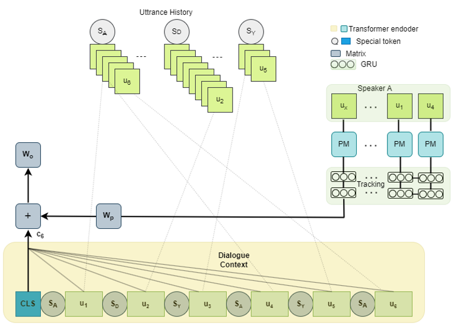
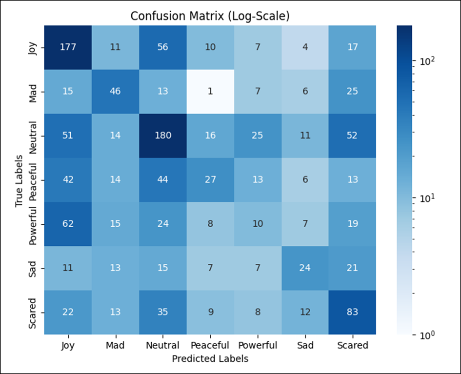

# EmoNet: Speaker-Aware Transformer for Conversational Emotion Recognition

[](https://www.python.org/downloads/)
[](https://pytorch.org/)
[](LICENSE)
[](https://doi.org/10.5281/zenodo.20048006)
[](presentation.pdf)

**Speaker-aware transformer for detecting emotions in conversational text. F1 = 39.18 on EmoryNLP.**
EmoNet was developed as my MS thesis at Liverpool John Moores University (March 2024). The model proposes three contributions to ERC — *Global Speaker Identity, a Speaker Behaviour module, and Weighted Cross-Entropy Loss.*

At the time of submission **(March 2024)**, this was competitive with the public PapersWithCode leaderboard for EmoryNLP, sitting between TUCORE-GCN_RoBERTa (39.24) and S+PAGE (39.14), and improving over the CoMPM baseline by **+1.81 F1**.



*EmoNet architecture: a Dialogue Context (DiCon) module captures the effect of all previous utterances on the current speaker's emotion, while a Speaker Behaviour (SB) module tracks the current speaker's historical utterances across dialogues using a GRU with a sliding window.*
> 📖 **Want the short version?** The 14-slide [thesis defense deck](presentation.pdf) covers the full work in 5 minutes. The complete [thesis paper](paper.pdf) is ~60 pages.

---

## Three contributions

**1. Global Speaker Identity.** Persistent speaker IDs across the entire dataset rather than per-dialogue, allowing the model to learn each speaker's behavioral patterns over time. When a speaker appears in a new dialogue, the model retains learned context from their previous utterances.

**2. Speaker Behaviour Module.** A GRU-based module tracking each speaker's historical utterances with a sliding window of configurable size. The window bounds compute and memory while preserving long-range speaker-specific context. The recurrence ensures distant utterances dilute naturally without being lost.

**3. Weighted Cross-Entropy Loss.** Handles EmoryNLP's class imbalance (the rarest emotion *Sad* appears at 1:4.5 vs. the most common emotion *Neutral*; *Powerful* and *Peaceful* are also significantly under-represented) without dataset augmentation. Augmenting conversational data would distort the natural emotional flow of dialogue, so reweighting the loss is the principled alternative.

---

## Results on EmoryNLP

Ablation showing the contribution of each component:

| Configuration                          | Accuracy | Weighted F1 |
| -------------------------------------- | -------- | ----------- |
| CoMPM baseline                         | 39.38    | 37.85       |
| + Global Speaker ID                    | 35.51    | 29.43       |
| + Speaker Behaviour                    | 39.90    | 36.96       |
| + Class-Weighted Loss (unnormalized)   | 40.43    | 37.13       |
| + Class-Weighted Loss (normalized)     | 41.18    | **39.18**   |



The full model handles *Neutral*, *Joy*, and *Scared* well; *Powerful* remains the hardest class — partly because it is one of the rarer labels and partly because it overlaps semantically with *Joy* in textual conversation without acoustic cues.

---

## Reflection (2026)

Since this thesis was completed in early 2024, the ERC field has shifted decisively toward **LLM-based generative approaches**. The current leaderboard is dominated by **InstructERC**, **CKERC**, **BiosERC**, and **LaERC-S** — all using LLaMA-2 with LoRA fine-tuning, retrieval-augmented prompting, and instruction-tuning over speaker characteristics.

Notably, the core ideas explored in EmoNet appear in modified forms in these systems:
- **BiosERC** injects speaker biographical information into LLMs — a direct descendant of *Global Speaker Identity*.
- **LaERC-S** uses two-stage instruction tuning where the first stage equips the LLM with speaker-specific characteristics — analogous to the *Speaker Behaviour* module, scaled inside an LLM.

The architectural intuition held; the field implemented it inside LLMs rather than as discrete transformer modules.

If I were to redo this work in 2026, I would build it as a **LoRA-fine-tuned LLaMA-3 or Qwen-2.5** with retrieval-based speaker-context prompting, following the InstructERC family of approaches. A small follow-up port is on my roadmap.

---

## Dataset

EmoNet is trained and evaluated on **EmoryNLP** (Zahiri & Choi, 2017), a textual-conversation ERC benchmark derived from transcripts of the TV show *Friends* with utterance-level annotations from Willcox's Feeling Wheel (7 emotions: *Neutral, Joyful, Peaceful, Powerful, Scared, Mad, Sad*).

- Train: 9,934 utterances / 713 scenes
- Dev: 1,344 utterances / 99 scenes
- Test: 1,328 utterances / 85 scenes

Dataset files are included in `dataset/EMORY/`. Source: [emorynlp/emotion-detection](https://github.com/emorynlp/emotion-detection).

---

## Requirements

- Python 3.8+
- PyTorch 1.8
- Hugging Face Transformers 4.4.0
- scikit-learn

```bash
pip install torch==1.8 transformers==4.4.0 scikit-learn
```

Hardware: trained on a single A6000 (48 GB) GPU. The model uses `roberta-large` as the encoder backbone for both the DiCon and Speaker Behaviour modules.

---

## Training

```bash
python3 train.py --initial pretrained --cls emotion --dataset EMORY
```

Key arguments:

| Flag           | Description                                              | Default        |
| -------------- | -------------------------------------------------------- | -------------- |
| `--pretrained` | Backbone model                                           | `roberta-large`|
| `--initial`    | Initial weights: `pretrained` or `scratch`               | `pretrained`   |
| `--cls`        | Label class: `emotion` or `sentiment`                    | `emotion`      |
| `--sample`     | Fraction of training set (0.0–1.0)                       | `1.0`          |
| `--freeze`     | Freeze the Speaker Behaviour pre-trained backbone        | `False`        |
| `--epoch`      | Training epochs                                          | `10`           |
| `--lr`         | Learning rate                                            | `1e-6`         |

Best model is selected by Weighted F1 on the dev set.

## Evaluation

```bash
python3 test.py
```

---

## Resources

| Resource                | File                                      | Length        |
| ----------------------- | ----------------------------------------- | ------------- |
| 📄 **Full thesis (DOI)** | [Zenodo (10.5281/zenodo.20048006)](https://doi.org/10.5281/zenodo.20048006) | ~60 pages |
| 🎤 **Defense slides**   | [`presentation.pdf`](presentation.pdf)    | 14 slides     |
| 📜 **Code**             | This repository                           | PyTorch       |

If you want a 5-minute version of this work, start with the slide deck.

---

## Reproducibility note

The trained model weights from the original 2024 study are not available for download. The architecture, training script (`train.py`), data pipeline (`ERC_dataset.py`), hyperparameters, and split definitions are all in this repository — anyone with access to a 48GB GPU should be able to reproduce the reported F1 of 39.18 on EmoryNLP using the commands in the Training section above.

The architectural ideas in EmoNet (Global Speaker Identity, Speaker Behaviour modeling) map naturally to LoRA-fine-tuned LLM approaches — see the Reflection (2026) section above for the connection to recent work like BiosERC and LaERC-S.

---

## Citation

If you find this work useful, please cite the thesis:

```bibtex

@mastersthesis{puthan2024emonet,
  title  = {EmoNet: A Transformer-Based Network for Conversational Emotion Recognition},
  author = {Puthan Veetil, Biju},
  school = {Liverpool John Moores University},
  year   = {2024},
  doi    = {10.5281/zenodo.20048006},
  url    = {https://doi.org/10.5281/zenodo.20048006}
}

```

The thesis PDF is in this repository: [paper.pdf](paper.pdf).

---

## Author

**Biju Puthan Veetil**
Lead AI Architect · Bengaluru, India
[LinkedIn](https://www.linkedin.com/in/biju-puthan-veetil/) · pv.biju@gmail.com